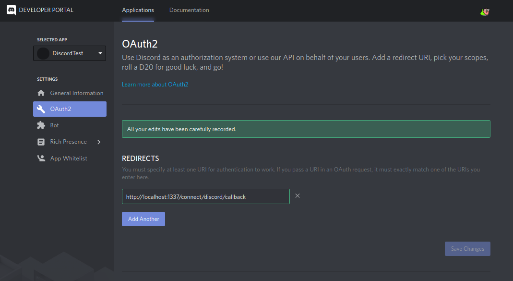

# Discord Setup

Go to [Discord developers](https://discordapp.com/developers/applications/) and create an app called 'DiscordTest'.
- Under OAuth2, add the redirect 'http://localhost:1337/connect/discord/callback'
- Navigate back to the General Information and copy your Client ID and Client Secret

## API Setup

Now that you have created your app on Discord you need to configure it within Strapi using the Client ID and Client Secret provided by Discord.

[Go to your providers settings](http://localhost:1337/admin/plugins/users-permissions/providers) and fill the form for Discord like the following:

- Enable the Discord Provider
- Client ID
- Client Secret

> Don't forget to save your modifications...

Now that the configuration is over [go to the front-end app](http://localhost:3000/auth/login) and try to login with Discord! 😉

> Fill an issue if it doesn't work (https://github.com/strapi/strapi-examples/issues/new)
