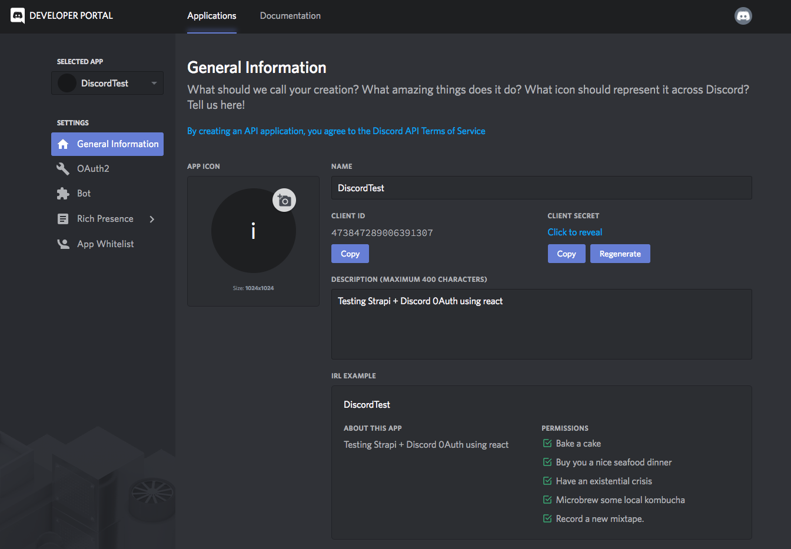
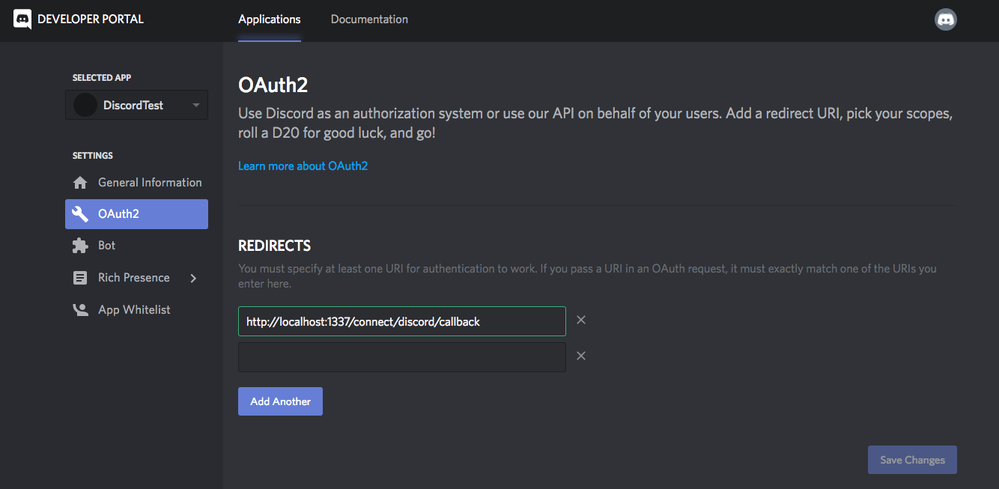
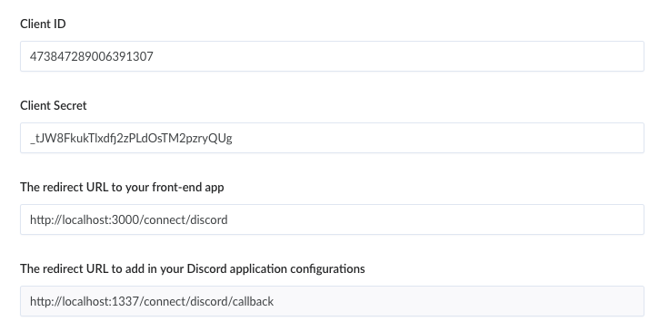

# Discord setup

Go to the [Discord developers](https://discordapp.com/developers/applications/) and create an app.

Under OAuth2, add the redirect `http://localhost:1337/connect/discord/callback`

## API Setup

[Go to the Admin](http://localhost:1337/admin/plugins/users-permissions/providers), enable Discord and enter your credentials.

> Go to localhost:3000 and try to sign up with discord
