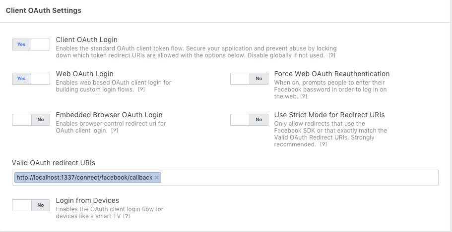

# Facebook Setup

Go to [Facebook developers](https://developers.facebook.com/) and create an app called 'test'.
- In the product section add `Facebook login`
- Set 'http://localhost:3000' as your website URL
- Copy for App Id and App Secret
- In the `Facebook login` > `Advanced settings` add: `http://localhost:1337/connect/facebook/callback` in the `Valid OAuth redirect URIs` field.

## API Setup

Now that you have created your app on Facebook you need to configure the Facebook provider in your project.

[Go to ](http://localhost:1337/admin/plugins/users-permissions/providers) and fill the form like the following:

;

> Don't forget to save your modifications...

Now that the configuration is over [go to](http://localhost:3000/auth/login) and try to login with Facebook 😉

> Fill an issue if it doesn't work (https://github.com/strapi/strapi-examples/issues/new)
