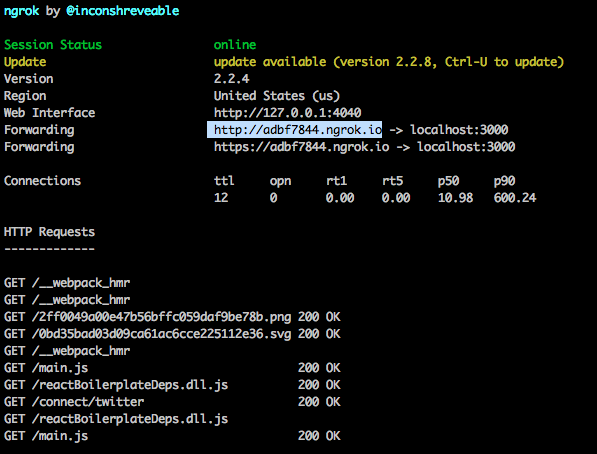
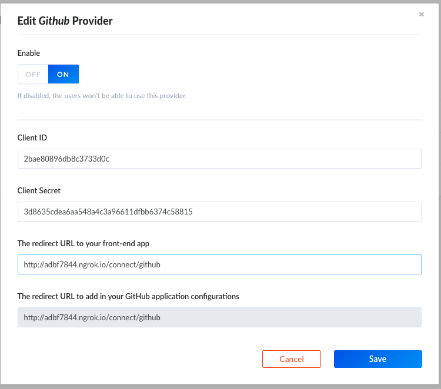

# GitHub Setup

Before setting up GitHub you'll need to install [ngrok](https://ngrok.com/2) because GitHub doesn't allow URLS from `localhost`.

After installing `ngrok` open a new terminal window and run

```bash
ngrok http 3000
```

> You need to have the react-login-app-running for this



- Copy URL displayed next to 'Forwarding' (it should look like this : `http://adbf7884.ngrok.io`) and go to [Github](https://github.com/settings/developers) and create a new app and fill the informations like the following.


## API Setup

[Go to](http://localhost:1337/admin/plugins/users-permissions/providers) and enable GitHub, enter your credentials.




### Test

- Go to the URL provided by ngrok to test your login
