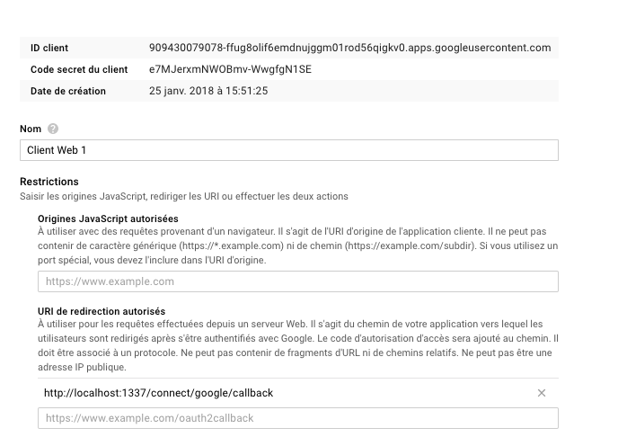
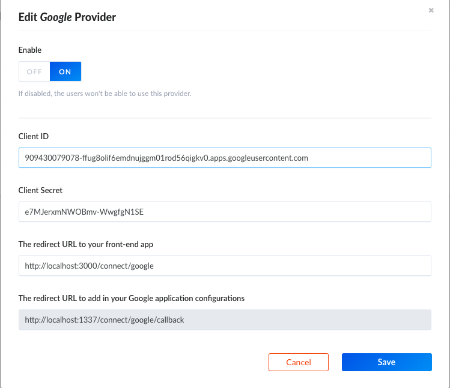

# Google setup

Go to the [Google developers console](https://console.developers.google.com/) and create a project.

Then in the credentials section set the Authorized redirect URI to `http://localhost:1337/connect/google/callback`

## API Setup

[Go to the Admin](http://localhost:1337/admin/plugins/users-permissions/providers), enable Google and enter your credentials.

> Go to localhost:3000 and try to sign up with google
