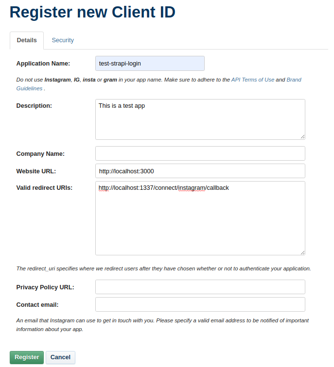
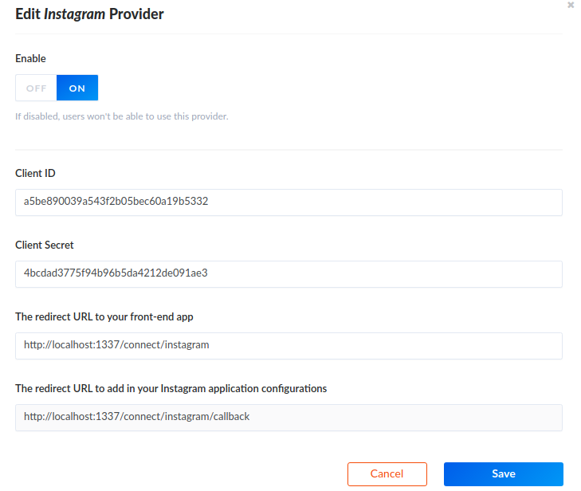

# Instagram Setup

Go to the [Instagram app creation page](https://www.instagram.com/developer/clients/register/) and create an app called `test-strapi-login`

Fill the form as follows and save

## API setup

Copy your credentials, [go to the Admin](http://localhost:1337/admin/plugins/users-permissions/providers) and enable Instagram.

