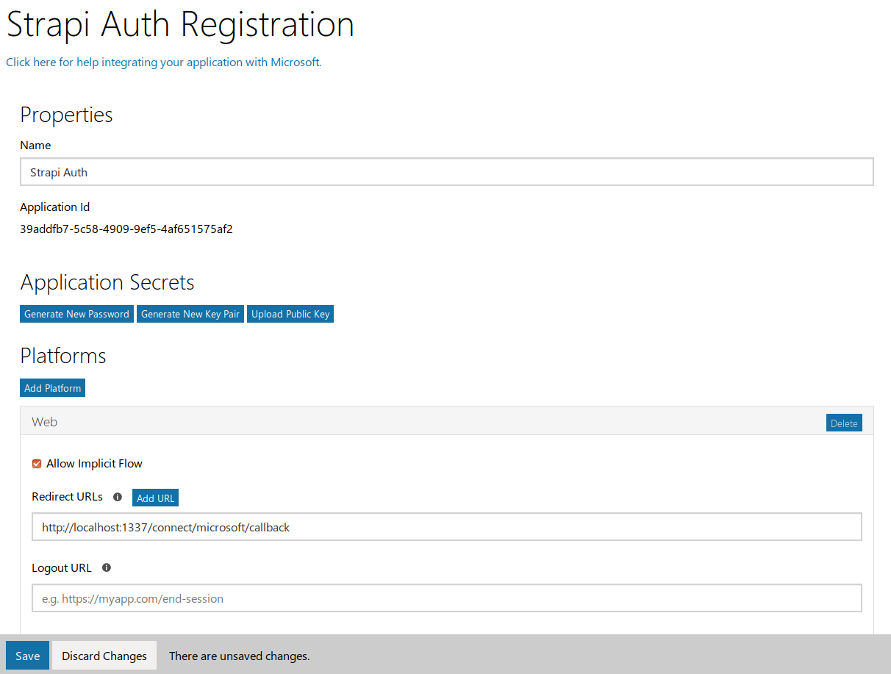
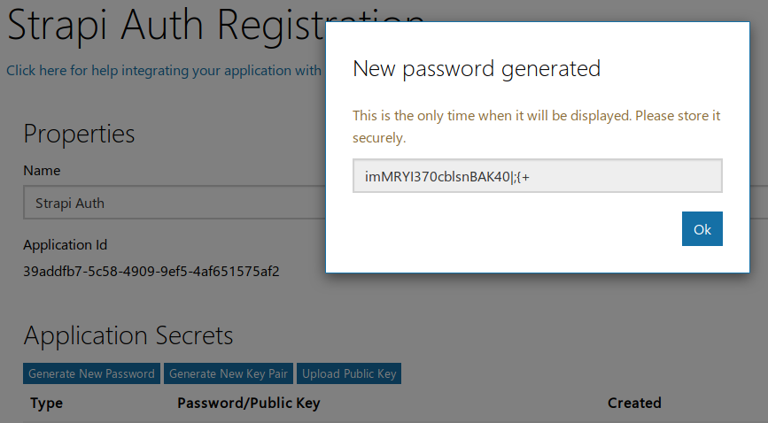
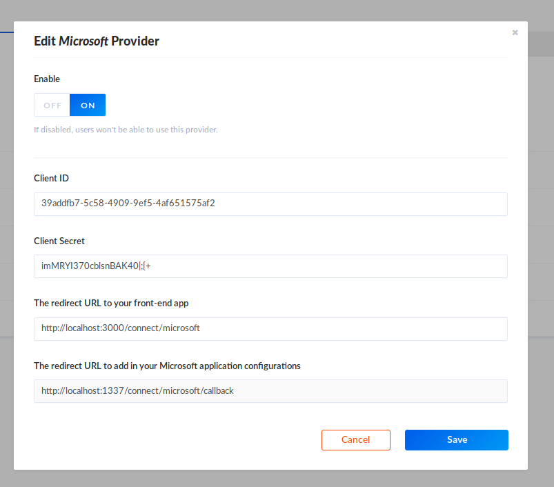

# Microsoft Setup

Go to the [Azure Applications List](https://portal.azure.com/#blade/Microsoft_AAD_RegisteredApps/ApplicationsListBlade) site and create an app, leaving the **Guided Setup** box unchecked.
- Under **Platforms**, click `Add Platform` and select `Web`
- In the **Redirect URLs** field, put `http://localhost:1337/connect/microsoft/callback`
- Click `Save` at the bottom of the screen

- In the **Application Secrets** section, click `Generate New Password`
- Copy the password, then click `Ok`

## API Setup

[Go to the Admin](http://localhost:1337/admin/plugins/users-permissions/providers), enable Microsoft and enter your credentials, starting with the application secret from above first.

Go to http://localhost:3000 and try to sign up with Microsoft
