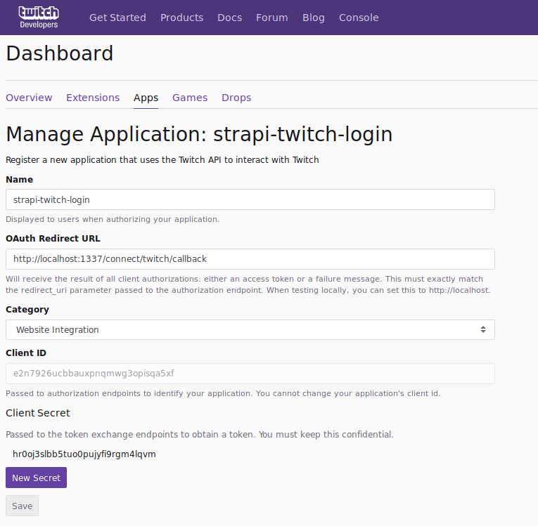
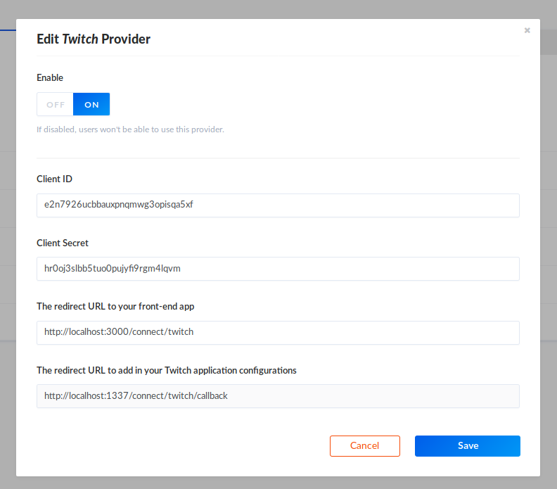

# Twitch Setup

Go to the [Twitch Developers](https://glass.twitch.tv/console/apps) console and create an app.
- For **OAuth Redirect URL**, use `http://localhost:1337/connect/twitch/callback`
- Under **Category** select `Website Integration`
- Once you save the form, click `Manage` for the application you just created
- At the bottom of the page, click the `New Secret` button

## API Setup

[Go to the Admin](http://localhost:1337/admin/plugins/users-permissions/providers), enable Twitch and enter your credentials.

Go to http://localhost:3000 and try to sign up with Twitch
