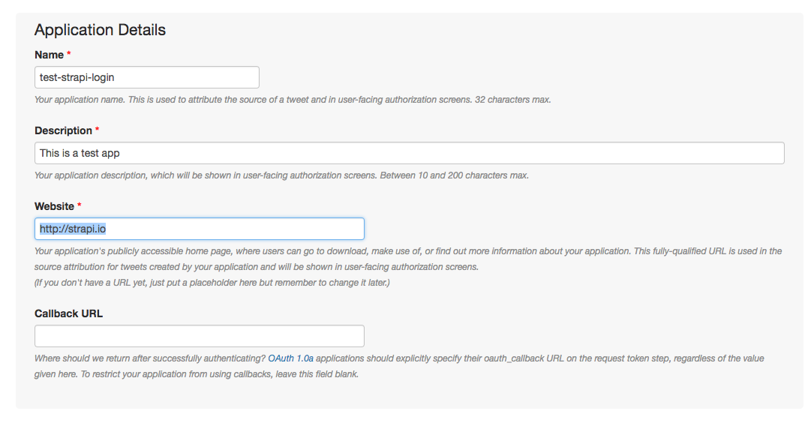
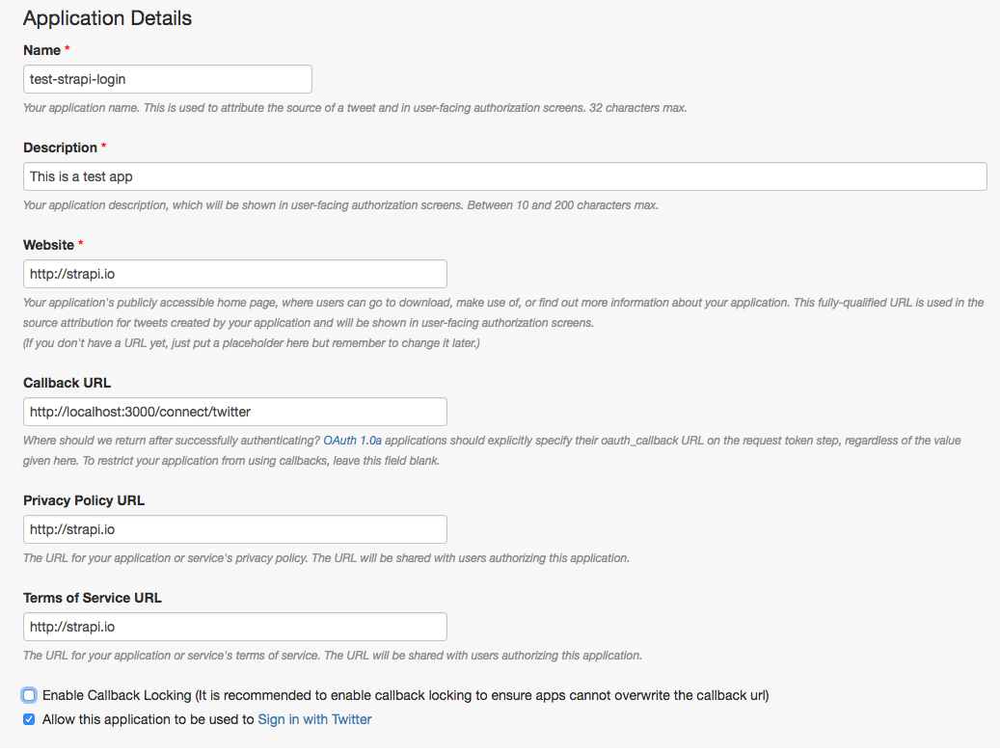
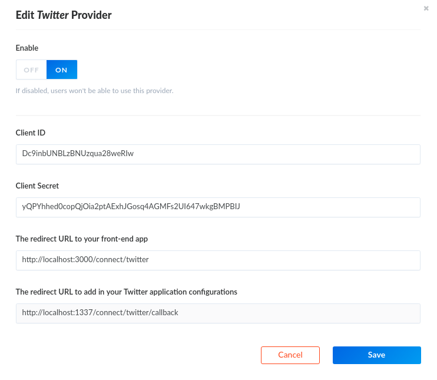

# Twitter Setup

Go to the [Twitter app creation page](https://apps.twitter.com/) and create an app called `test-strapi-login`

You won't be able to set your website as `localhost:3000` so enter an url like `http://strapi.io` in order to create your app.

In the settings section fill the form as follows

Then in the permission section check the `Request email addresses from users` field and save

## API setup

Copy your credentials and [go to](http://localhost:1337/admin/plugins/users-permissions/providers) and enable Twitter

