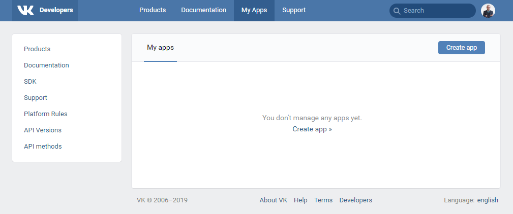
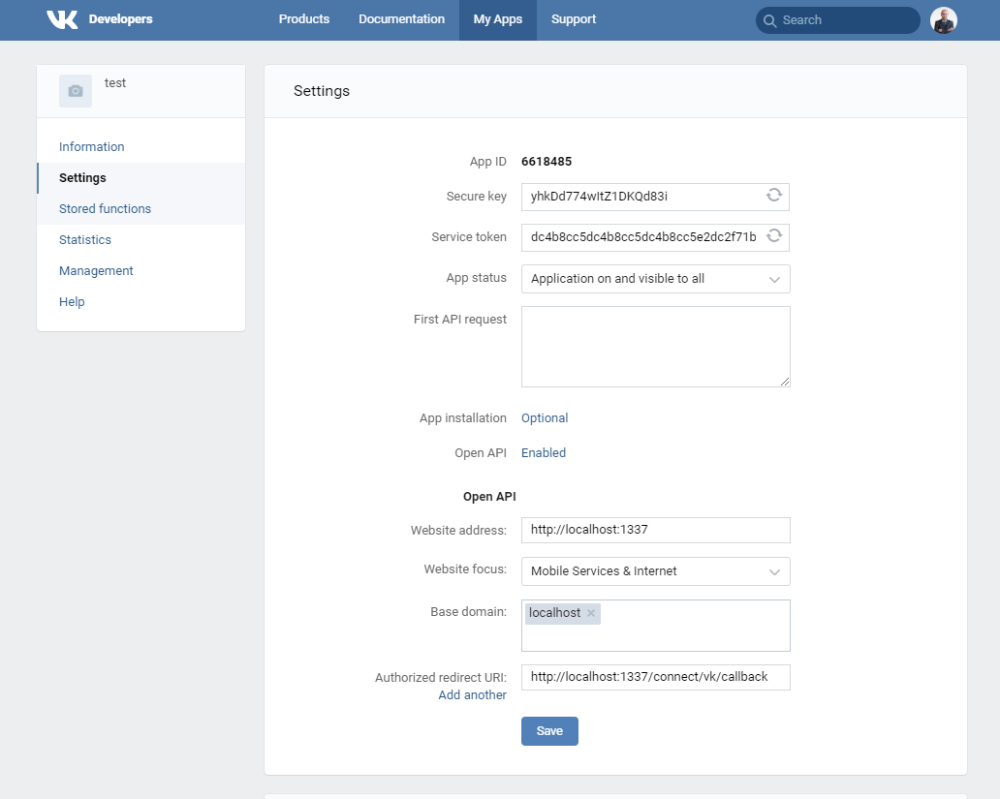
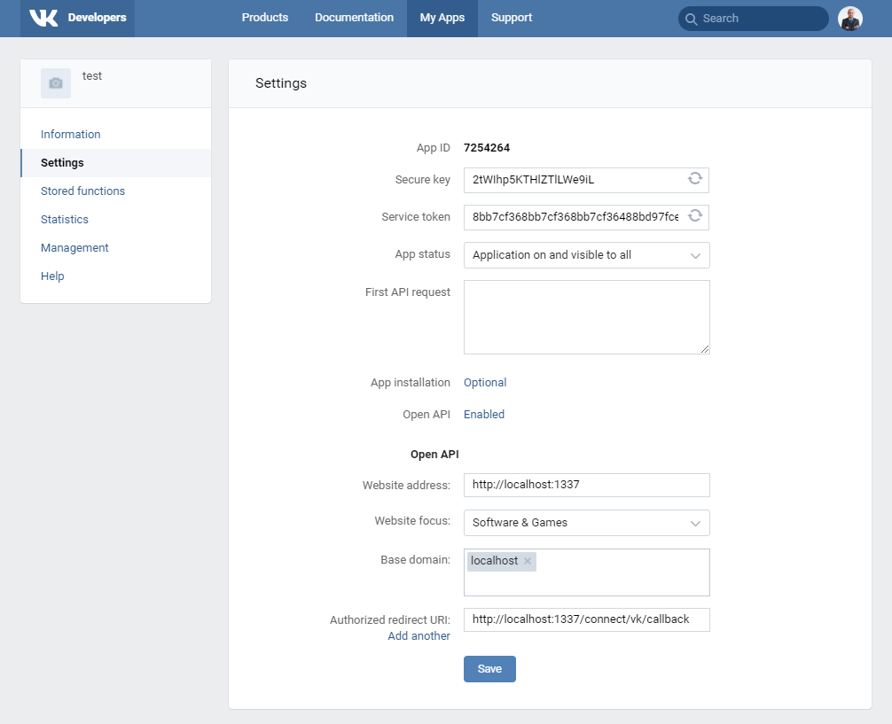
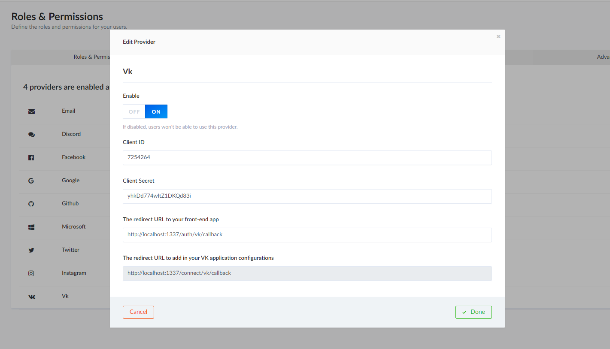

# VK setup

Go to the [VK developers](https://vk.com/apps?act=manage) and click **Create app**.

Select Website platform, specify title, address and base domain. Click **Connect website**.

Then in the **settings** section set the Authorized redirect URI to `http://localhost:1337/connect/vk/callback`.

## API Setup

[Go to the Admin](http://localhost:1337/admin/plugins/users-permissions/providers), enable VK and enter your credentials.

> Go to localhost:3000 and try to sign up with VK
